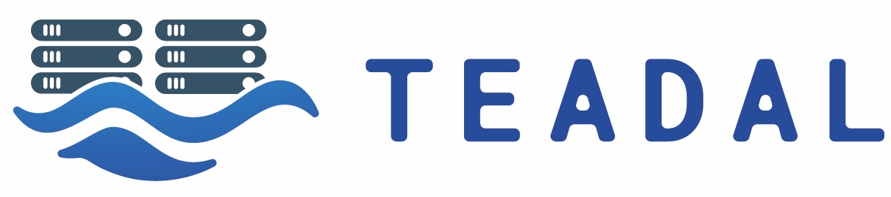

# TEADAL project public repository

TEADAL is a EU funded project that provides key cornerstone technologies to create stretched data lakes spanning the cloud-edge continuum and multi-cloud, providing privacy, confidentiality, and energy-efficient data management. For more information, refer to [https://teadal-eu.org](https://teadal.eu)

This github organization collects the main technologies developed in the project and made available to the opensource community. All the tools are under the Apache 2.0 license.

[TEADAL node](https://github.com/HE-TEADAL-PROJECT/teadal-node) represents the cornerstone of the TEADAL solution. It is k8s based platform which can be configured to host one or more of the tools developed in the project
- [Advocate](https://github.com/HE-TEADAL-PROJECT/advocate)
- [Automatic Service Generator](https://github.com/HE-TEADAL-PROJECT/asg-tool)
- [AI driven performance monitoring](https://github.com/HE-TEADAL-PROJECT/ai-driven-performance-monitoring)
- [Data catalog]()
- [Policy Manager](https://github.com/HE-TEADAL-PROJECT/opa-policy-manager)

Tools in experimental stages
- [OPA LLM Editor](https://github.com/HE-TEADAL-PROJECT/opa-llm-editor)
---

TEADAL (Trustworthy, Energy-Aware federated DAta Lakes along the computing continuum) project is funded by the EU’s Horizon Europe program under Grant Agreement number 101070186. Views and opinions expressed are however those of the author(s) only and do not necessarily reflect
